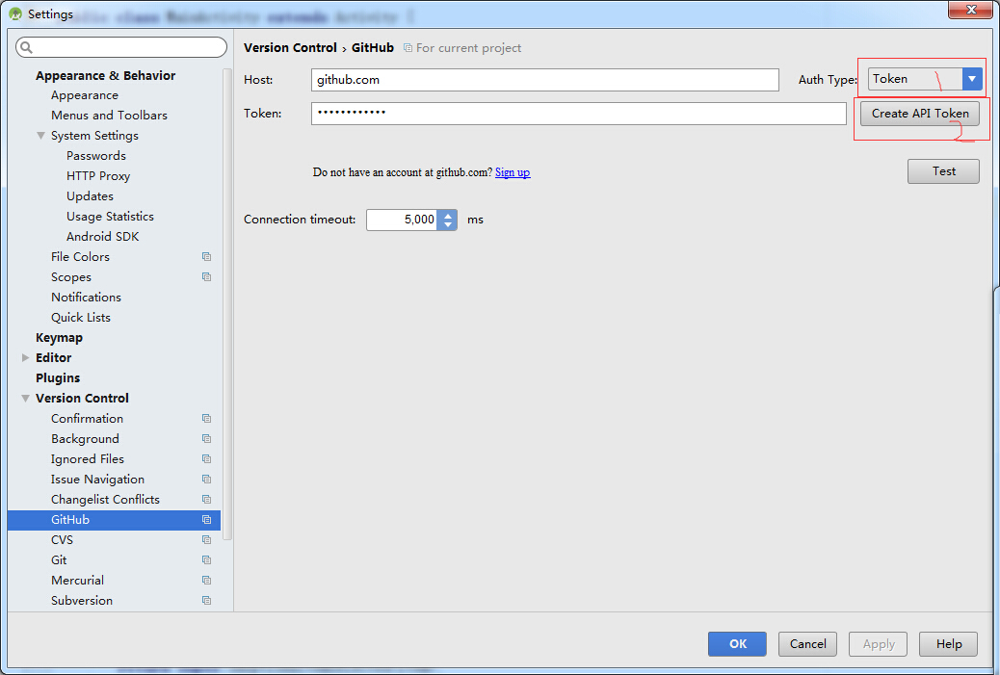

# Android Studio 将工程上传到github
自己学习git备忘录

自己按照网上的步骤上传到github，但是提示successfully created project 'git test' on github but initial push failed：。。。。

然后自己搜索一下发现用这种方法可以上传成功  把右边的Auth type下拉选项改为token，然后点击Create API token ，测试一下就好了

后来我又发现我吧Auth type 改为password后既然也能成功的拉取和上传代码了。我晕。

